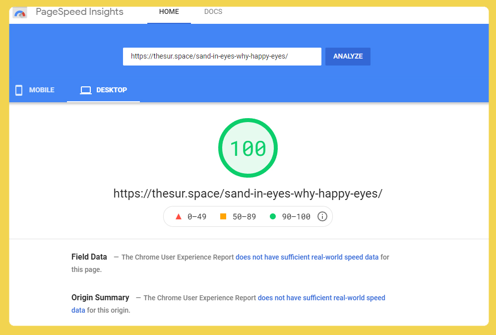
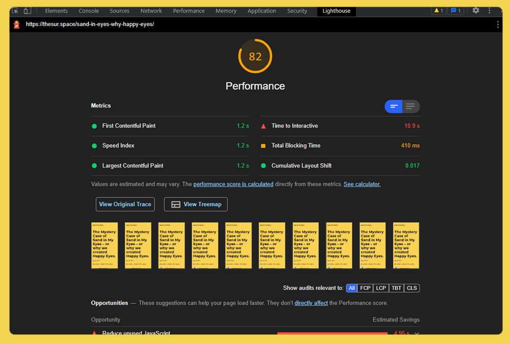
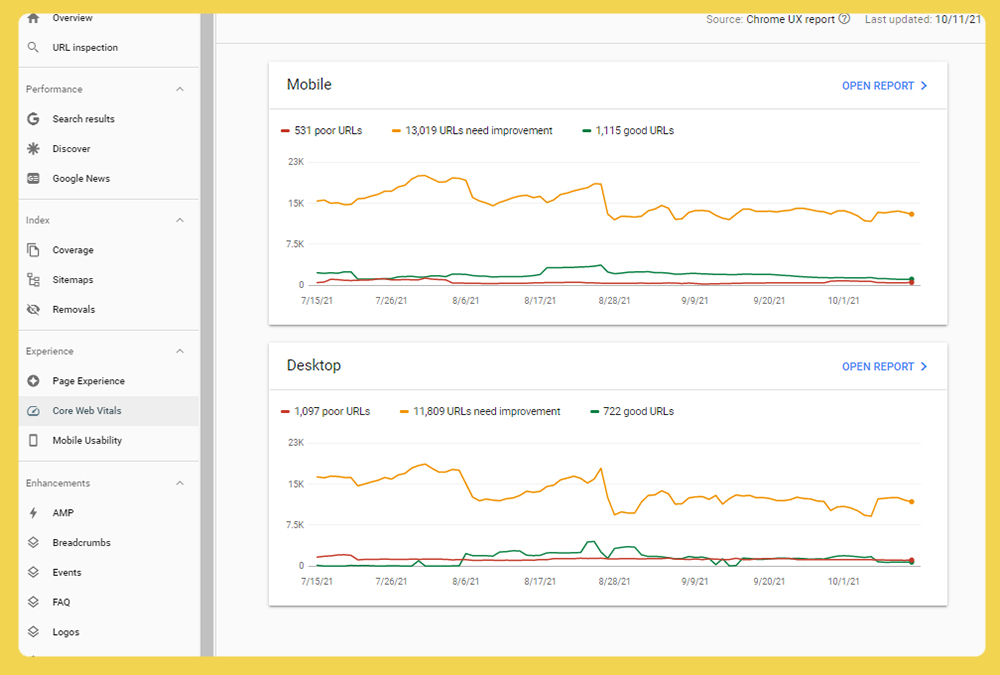
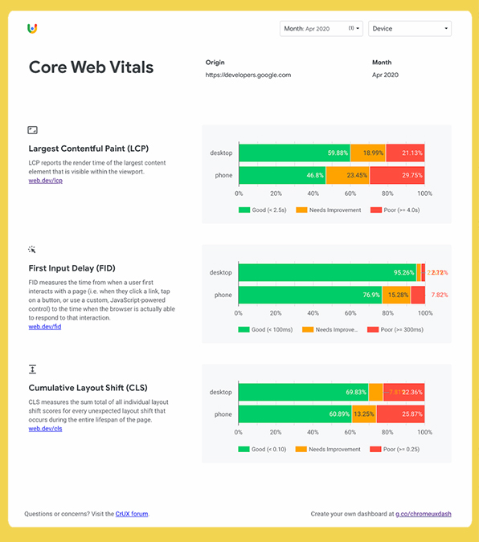
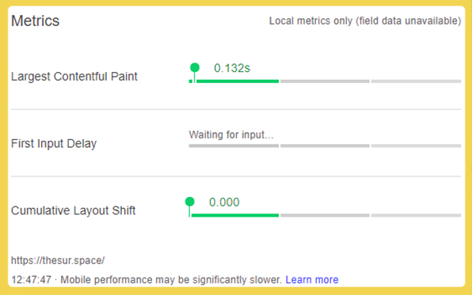
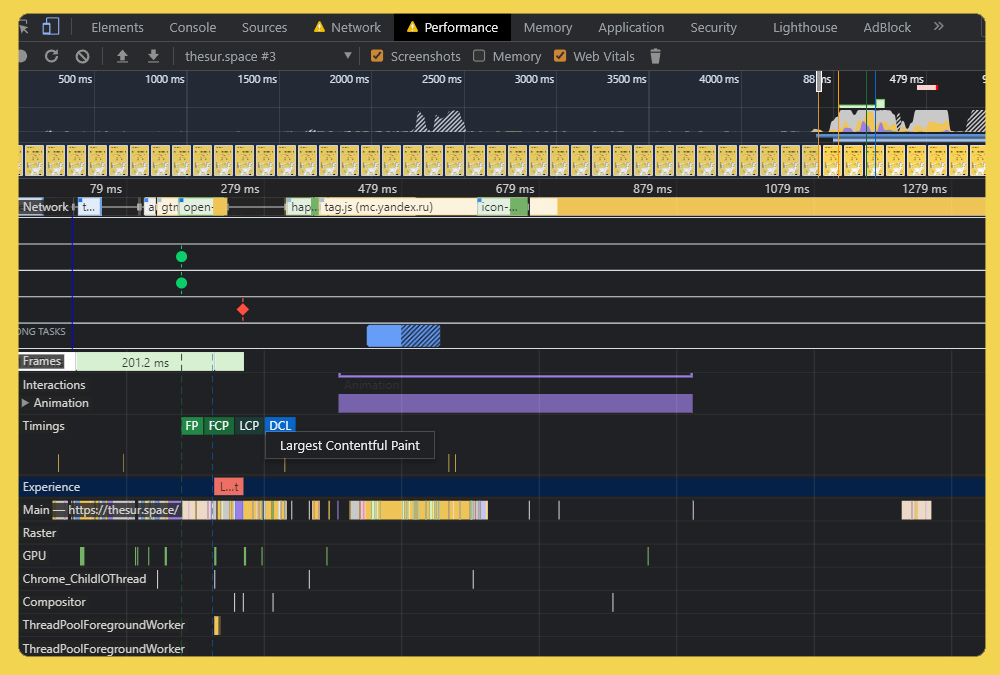
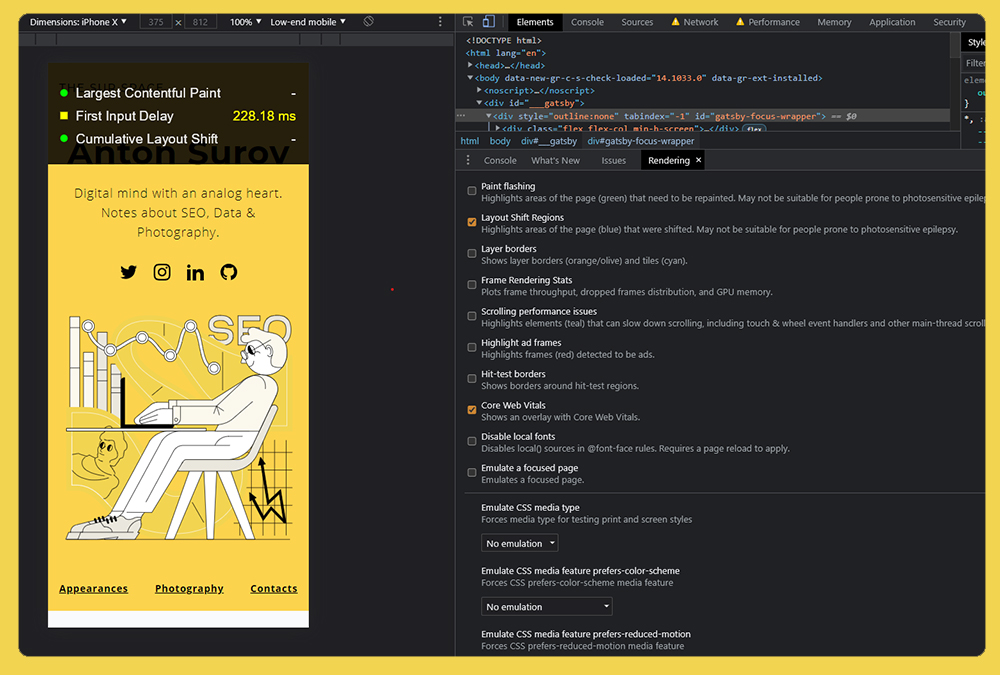

It’s October 2021 and chances are you have already heard about the Chrome experience update and Core Web Vitals. Core Web vitals (aka CWV) are everywhere. At least, that’s how I feel when 70% of my YouTube feed is CWV-related content and the other 30% is videos about smart octopuses (don’t ask, just check it out). 

So, how do you check for your website’s web vitals’ performance? Which tools should you use to make sure that the last fixes you implemented actually improved your web vitals’ score? In this article, I wanted to share 7 tools you can use to test web vitals performance. I use them almost daily.  

Let’s start with a quick reminder what CWV are and how they are measured.

**What are Core Web Vitals?**

<Interesting>

**Largest Contentful Paint (LCP):** measures loading performance. To provide a good user experience, LCP should occur within 2.5 seconds of when the page first starts loading.

**First Input Delay (FID):** measures interactivity. To provide a good user experience, pages should have a FID of 100 milliseconds or less.

**Cumulative Layout Shift (CLS):** measures visual stability. To provide a good user experience, pages should maintain a CLS of 0.1. or less.

</Interesting>

**What is the difference between CrUX & data?**

<Interesting>

**Field Data** – based on anonymized data from Chrome User Experience Report 

**Lab Data** – based on a simulation you run on your device (website might work astonishingly well on your gaming laptop, but that might not reflect user experience in the real world). 

</Interesting>

## Top 7 tools to check for your web vitals performance

### 1. Wondering where to start? Start with [PageSpeed Insights](https://developers.google.com/speed/pagespeed/insights/).

The absolute staple of any SEO-focused performance optimization is Google’s PageSpeed Insights. It’s a great tool for having a quick look at the CWVs’ performance, and covers a whole range of metrics and recommendations with a quick outline of how you are doing on both mobile and desktop. The tools provide both field and lab data reports. It’s a great tool but has a single drawback: it checks a single page only. 

Use this handy [bookmark/bookmarklet](https://support.mozilla.org/en-US/kb/bookmarklets-perform-common-web-page-tasks) to quickly check performance for your page: [speed-test](javascript:(function(){%20window.open('http://developers.google.com/speed/pagespeed/insights/?url=%27+encodeURIComponent(location.href))})();). 

### 2. Need to run a few tests on the staging environment? Try Lighthouse.

Another ultra-popular tool for performance testing. Lighthouse is available via Chrome. It provides a similar report to PageSpeed Insights, but only utilizes the Lab Data. Personally, I use Lighthouse mostly to test performance of pages on staging environments. 
Similar to PageSpeed Insights, Lighthouse assigns a score to the tested pages. If you want to understand how this score is calculated, have a look at [Lighthouse Scoring Calculator.](https://googlechrome.github.io/lighthouse/scorecalc/#FCP=2760&SI=5800&FMP=4000&TTI=7300&FCI=6500&LCP=4000&TBT=600&CLS=0.25&device=mobile&version=6&version=8).

### 3. No comments needed: this is Google Search Console. 

A tool which hardly needs introduction, Search Console offers a brand new Core Web Vitals report. This report uses CrUX data and gives a useful glimpse of how your website is doing in general. 
Two important alerts about using this report:

- URL performance is grouped by status, metric type, and URL group (groups of similar web pages). So, it is hard to drill down and see the performance of a singular URL. 
- CrUX data has a [28-day update window](https://support.google.com/webmasters/answer/9205520?hl=en). I know it looks like data is continuous but, in my experience, you might see a whole bunch of pages all of a sudden move from “Bad” to “Good”.  

### 4. Wondering if your competitors are optimizing for CWV? Visualise CrUX data in Google Data Studio.

Many digital marketers are familiar with reliable old Data Studio. And Google is generously sharing CrUX data with everyone via BigQuery. I won’t go into detail regarding the implementation since it’s all outlined perfectly in [this article on WebDEV](https://web.dev/chrome-ux-report-data-studio-dashboard/). 

Personally, I use this report to see how competitors are doing in my niche – and hey, it looks great in presentations. 

### 5. Want to assess pages even faster? Web Vitals (Chrome Extension).	

Everyone loves a good Chrome extension, and this lightweight and easy-to-use extension measures CWV metrics in real time at the page level. It is safe to use since data in this extension is consistent with data in other tools such as Lighthouse. Check it out!  

### 6. Need to dig a little deeper? DevTools Performance panel.

If you want to find which elements cause layout shift or what FID/LCP is for a page you are testing, DevTools’ panel is the way to go. It is my go-to way to diagnose performance issues on the website in both staging and production environments. 

If you’ve never used it before, don’t worry. It’s pretty straightforward. Just follow these steps: 
- Press Control+Shift+J (or Command+Option+J on Mac) to open DevTools.
- Click the Performance tab. (Make sure that web vitals recording is enabled.) 
- Click Record.
- Manually reload the page.
- Wait for the page to load and then stop recording. (I usually record for at least 3 seconds.) 

This way you can zoom in, diagnose and find patterns when assessing CWVs. 

### 7. Want a clear visual representation of layout shift? Chrome DevTools Rendering Panel. 

Sometimes, I need to show my stakeholders or devs where exactly and how layout shift is happening. In the recent Chrome update, Google added functionality to highlight layout shifts occurring on the page. 

To use it, follow these steps: 

- Press Control+Shift+J (or Command+Option+J on Mac) to open DevTools.
- Press Cmd + Shift + P > and type Render.
- Navigate to the Render panel and Enable the Layout Shift Regions option.
- Manually reload the page.
- Observe and enjoy. (Usually I disable cash and enable throttling to better see results.) 

### 8. Bonus: Paid tools.

There are heaps of paid tools already in the Core Web Vitals bandwagon.

This is outside the scope of this article, but I’ll list a few tools which I’ve used to audit web vitals in batches. 
&nbsp;
- Screaming Frog
- SEMrush
- DeepCrawl
- Botify

There you have it: the top 7 tools to check for web vitals’ performance across different scenarios and  circumstances. This is a dynamic list that I’m planning to keep updating with new tools and techniques. 

Drop me a line if you have questions or suggestions regarding web vitals.
